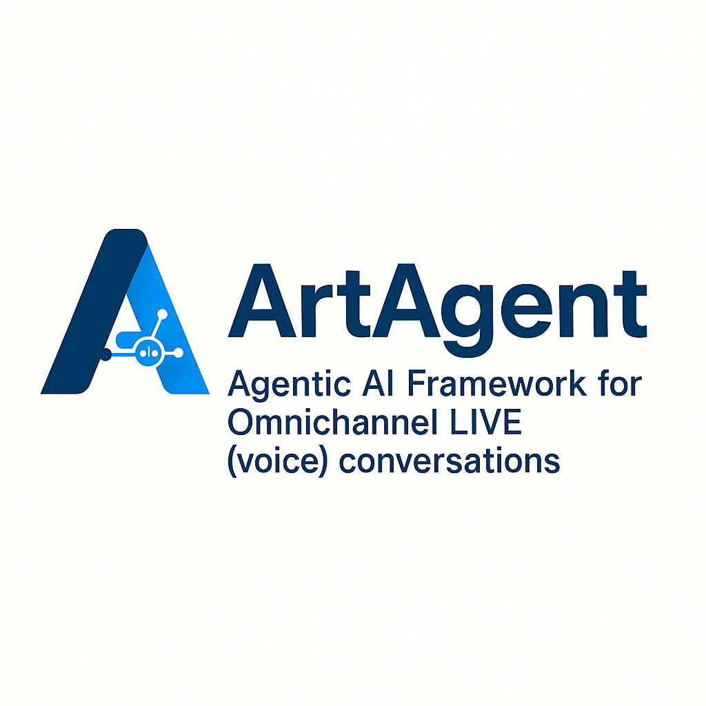
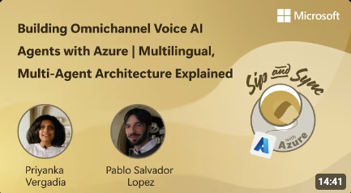
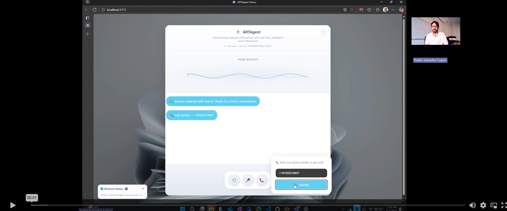
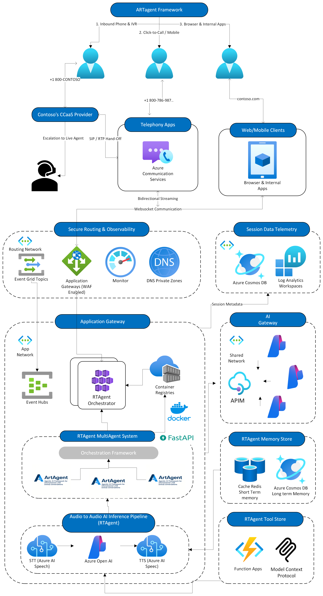
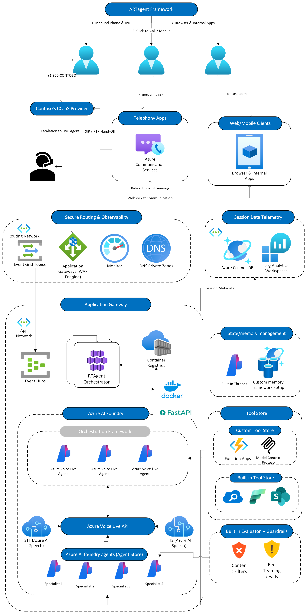
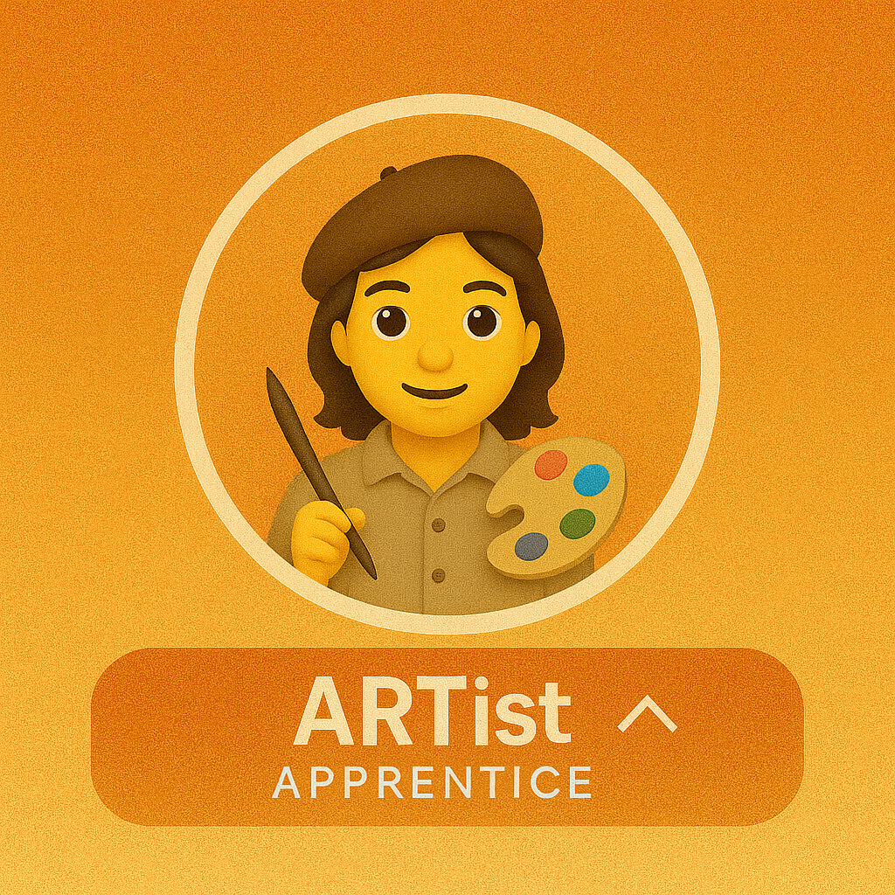
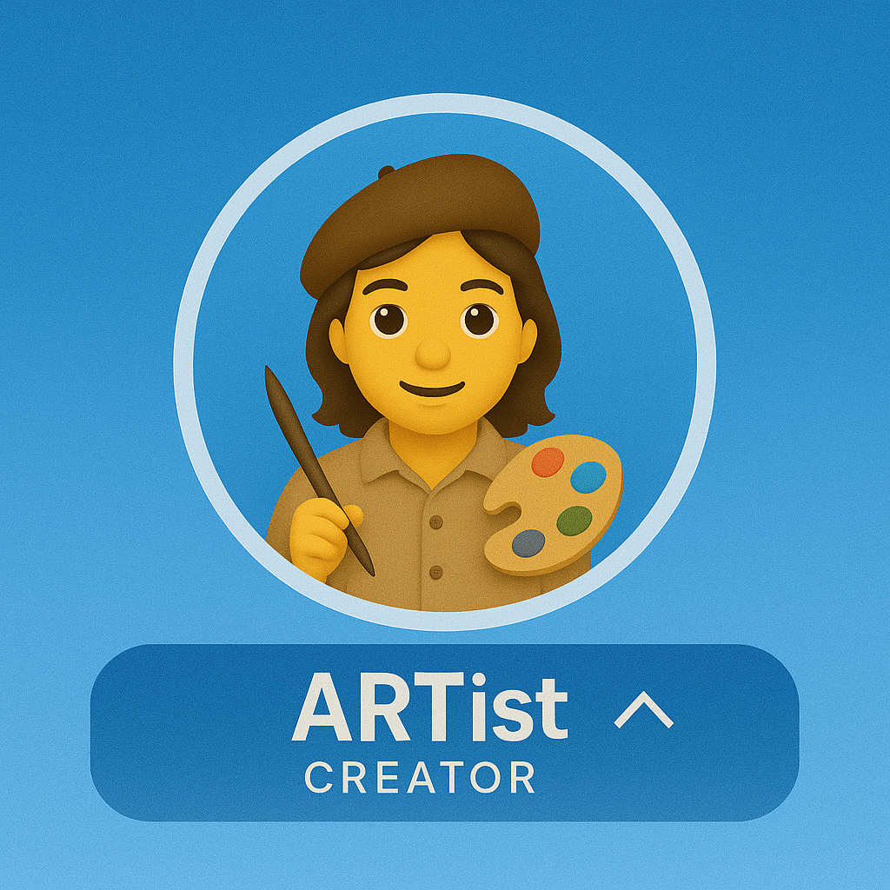
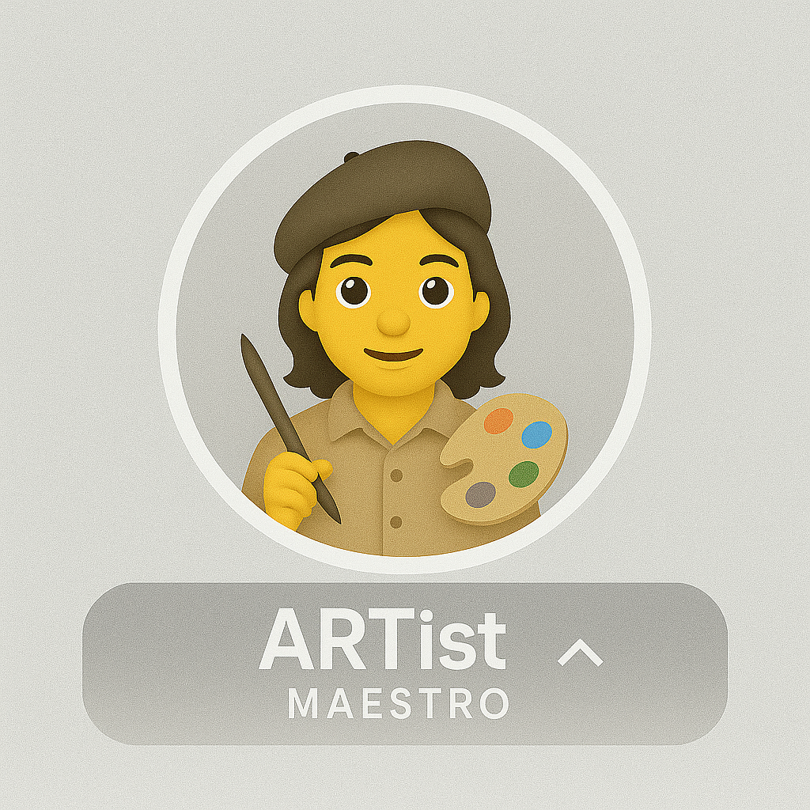

<!-- markdownlint-disable MD033 MD041 -->

<div align="center">

# Azure Real-Time (ART) Agent Accelerator

[📖 Documentation](https://aiappsgbbfactory.github.io/art-voice-agent-accelerator/) · [🚀 Quick Start](#getting-started) · [🏗️ Architecture](#the-how-architecture) · [🎨 Community](docs/community/artist-certification.md)

> **TL;DR**: Build real-time, multimodal and omnichannel agents on Azure in minutes, not months. Our approach is code-first, modular, ops-friendly & extensible.

</div>



You own the agentic design; this repo handles the end-to-end voice plumbing. We keep a clean separation of concerns—telephony (ACS), app middleware, AI inference loop (STT → LLM → TTS), and orchestration—so you can swap parts without starting from zero. Shipping voice agents is more than "voice-to-voice." You need predictable latency budgets, media handoffs, error paths, channel fan-out, barge-in, noise cancellation, and more. This framework gives you the e2e working spine so you can focus on what differentiates you—your tools, agentic design, and orchestration logic (multi-agent ready).

<br clear="both" />

## **See it in Action**

<p align="center">
  <a href="https://www.youtube.com/watch?v=H_uAA5_h40E"></a>
  &nbsp;&nbsp;&nbsp;&nbsp;
  <a href="https://vimeo.com/1115976100"></a>
</p>
<p align="center">
  <a href="https://www.youtube.com/watch?v=H_uAA5_h40E"><b>📺 Full Overview</b></a>
  &nbsp;&nbsp;&nbsp;&nbsp;&nbsp;&nbsp;&nbsp;&nbsp;&nbsp;&nbsp;&nbsp;&nbsp;&nbsp;&nbsp;&nbsp;&nbsp;
  <a href="https://vimeo.com/1115976100"><b>🎬 Demo Walkthrough</b></a>
</p>

<details>
<summary><b>💡 What you get</b></summary>

### **What you get**

- **Omnichannel, including first-class telephony**. Azure Communication Services (ACS) integration for PSTN, SIP transfer, IVR/DTMF routing, and number provisioning—extendable for contact centers and custom IVR trees.

- **Transport that scales**. FastAPI + WebSockets for true bidirectional streaming; runs locally and scales out in Kubernetes. Leverages ACS bidirectional media streaming for low-latency ingest/playback (barge-in ready), with helper classes to wire your UI WebSocket client or loop back into ACS— the plumbing is done for you.

- **Model freedom**. Use GPT-family or your provider of choice behind a slim adapter; swap models without touching the transport.

- **Clear seams for customization**. Replace code, switch STT/TTS providers, add tool routers, or inject domain policies—without tearing down the whole app.

### **Choose your voice inference pipeline (voice‑to‑voice):**

- **Build from scratch (maximum control).** Use our AI inference layer and patterns to wire STT → LLM → TTS with your preferred Azure services and assessments. Own the event loop, intercept any step, and tailor latency/quality trade-offs for your use case. Ideal for on‑prem/hybrid, strict compliance, or deep customization.

- **Managed path (ship fast, enterprise‑ready).** Leverage the latest addition to the Azure AI family—Azure Voice Live API (preview)—for voice-to-voice media, and connect to Azure AI Foundry Agents for built-in tool/function calling. Keep your hooks; let Azure AI Foundry handle the media layer, scaling, noise suppression, and barge-in.

- **Bring your own voice‑to‑voice model.** Drop in your model behind(e.g., latest gpt‑realtime or equivalent). Transport/orchestration (including ACS telephony) stays the same—no app changes.

*The question of the century: Is it production-ready?*

“Production” means different things, but our intent is clear: this is an accelerator—it gets you ~80% of the way with battle-tested plumbing. You bring the last mile: hardening, infrastructure policies, security posture, SRE/DevOps, and your enterprise release process.

We ship the scaffolding to make that last mile fast: structured logging, metrics/tracing hooks, and a load-testing harness so you can profile end-to-end latency and concurrency, then tune or harden as needed to reach your target volume.

</details>

## **The How (Architecture)**

Two orchestration modes—same agent framework, different audio paths:

| Mode | Path | Latency | Best For |
|------|------|---------|----------|
| **SpeechCascade** | Azure Speech STT → LLM → TTS | ~400ms | Custom VAD, phrase lists, Azure voices |
| **VoiceLive** | Azure VoiceLive SDK (gpt-4o-realtime) | ~200ms | Fastest setup, lowest latency |

```bash
# Select mode via environment variable
export ACS_STREAMING_MODE=MEDIA       # SpeechCascade (default)
export ACS_STREAMING_MODE=VOICE_LIVE  # VoiceLive
```

<details>
<summary><strong>🔧 SpeechCascade — Full Control</strong></summary>
<br>


**You own each step:** STT → LLM → TTS with granular hooks.

| Feature | Description |
|---------|-------------|
| **Custom VAD** | Control silence detection, barge-in thresholds |
| **Azure Speech Voices** | Full neural TTS catalog, styles, prosody |
| **Phrase Lists** | Boost domain-specific recognition |
| **Sentence Streaming** | Natural pacing with per-sentence TTS |

Best for: On-prem/hybrid, compliance requirements, deep customization.

📖 [Cascade Orchestrator Docs](docs/architecture/orchestration/cascade.md)

</details>

<details>
<summary><strong>⚡ VoiceLive — Ship Fast</strong></summary>
<br>

> [!NOTE]
> Uses [Azure VoiceLive SDK](https://learn.microsoft.com/en-us/azure/ai-services/speech-service/voice-live) with gpt-realtime in the backend.



**Managed voice-to-voice:** Azure-hosted GPT-4o Realtime handles audio in one hop.

| Feature | Description |
|---------|-------------|
| **~200ms latency** | Direct audio streaming, no separate STT/TTS |
| **Server-side VAD** | Automatic turn detection, noise reduction |
| **Native tools** | Built-in function calling via Realtime API |
| **Azure Neural Voices** | HD voices like `en-US-Ava:DragonHDLatestNeural` |

Best for: Speed to production, lowest latency requirements.

📖 [VoiceLive Orchestrator Docs](docs/architecture/orchestration/voicelive.md) · [VoiceLive SDK Samples](samples/voice_live_sdk/)

</details>

## **Getting Started**

### 📋 Prerequisites

| Requirement | Quick Check |
|------------|-------------|
| Azure CLI | `az --version` |
| Azure Developer CLI | `azd version` |
| Docker | `docker --version` |
| Azure Subscription | `az account show` |
| Contributor Access | Required for resource creation |

### ⚡ Fastest Path (15 minutes)

```bash
# 1. Clone the repository
git clone https://github.com/Azure-Samples/art-voice-agent-accelerator.git
cd art-voice-agent-accelerator

# 2. Login to Azure
azd auth login

# 3. Deploy everything
azd up   # ~15 min for complete infra and code deployment
```

> [!NOTE]
> If you encounter any issues, please refer to [TROUBLESHOOTING.md](TROUBLESHOOTING.md)

**Done!** Your voice agent is running. Open the frontend URL shown in the output.


### 🗺️ Repository Structure

```
📁 apps/artagent/           # Main application
  ├── 🔧 backend/          # FastAPI + WebSockets voice pipeline
  ├── 🌐 frontend/         # Vite + React demo client
  └── 📜 scripts/          # Helper launchers
📁 src/                    # Core libraries (ACS, Speech, AOAI, Redis, Cosmos, VAD, tools)
📁 samples/                # Tutorials and examples (hello_world, labs)
📁 infra/                  # Infrastructure as Code (Terraform)
📁 docs/                   # Guides and references
📁 tests/                  # Pytest suite and load testing
📁 utils/                  # Logging/telemetry helpers
```

### 📚 Documentation Guides

- Start here: [Getting started](https://aiappsgbbfactory.github.io/art-voice-agent-accelerator/getting-started/)
- Deploy in ~15 minutes: [Quick start](https://aiappsgbbfactory.github.io/art-voice-agent-accelerator/getting-started/quickstart/)
- Run locally: [Local development](https://aiappsgbbfactory.github.io/art-voice-agent-accelerator/getting-started/local-development/)
- Setup: [Prerequisites](https://aiappsgbbfactory.github.io/art-voice-agent-accelerator/getting-started/prerequisites/)
- Try the UI: [Demo guide](https://aiappsgbbfactory.github.io/art-voice-agent-accelerator/getting-started/demo-guide/)
- Production guidance: [Deployment guide](https://aiappsgbbfactory.github.io/art-voice-agent-accelerator/deployment/)
- Understand the system: [Architecture](https://aiappsgbbfactory.github.io/art-voice-agent-accelerator/architecture/)
- IaC details (repo): [infra/README.md](infra/README.md)


## **Community & ARTist Certification**

**ARTist** = Artist + ART (Azure Real-Time Voice Agent Framework)

<div align="center">
  
  
  
</div>

<br>

Join the community of practitioners building real-time voice AI agents! The **ARTist Certification Program** recognizes builders at three levels:

- **Level 1: Apprentice** — Run the UI, demonstrate the framework, and understand the architecture
- **Level 2: Creator** — Build custom agents with YAML config and tool integrations  
- **Level 3: Maestro** — Lead production deployments, optimize performance, and mentor others

Earn your badge, join the Hall of Fame, and connect with fellow ARTists!

👉 **[Learn about ARTist Certification →](docs/community/artist-certification.md)**


## **Contributing**
PRs & issues welcome—see [`CONTRIBUTING.md`](CONTRIBUTING.md) before pushing.

## **License & Disclaimer**
Released under MIT. This sample is **not** an official Microsoft product—validate compliance (HIPAA, PCI, GDPR, etc.) before production use.

<br>

> [!IMPORTANT]  
> This software is provided for demonstration purposes only. It is not intended to be relied upon for any production workload. The creators of this software make no representations or warranties of any kind, express or implied, about the completeness, accuracy, reliability, suitability, or availability of the software or related content. Any reliance placed on such information is strictly at your own risk.