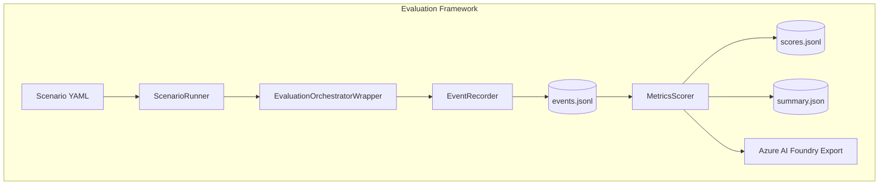

# Evaluation Framework Reference

> **Comprehensive guide to the ART Voice Agent evaluation system for measuring agent quality, performance, and cost metrics.**

## Overview

The evaluation framework provides offline and scenario-based testing of voice agents without requiring live Azure Communication Services infrastructure. It enables:

- **Scenario-driven testing** using YAML definitions
- **A/B comparison** between agent configurations
- **Comprehensive metrics** (tool precision/recall, groundedness, latency, verbosity, cost)
- **Azure AI Foundry integration** for cloud-based evaluation
- **Zero-touch instrumentation** via composition wrappers

## Architecture



**Data Flow:**

1. **Scenario YAML** defines test cases with expected behaviors
2. **ScenarioRunner** loads scenarios and orchestrates execution
3. **EvaluationOrchestratorWrapper** wraps the agent orchestrator
4. **EventRecorder** captures all events to `events.jsonl`
5. **MetricsScorer** computes metrics and generates outputs

## Components

| Component | Location | Purpose |
|-----------|----------|---------|
| `ScenarioRunner` | `tests/evaluation/scenario_runner.py` | Runs scenarios from YAML |
| `ComparisonRunner` | `tests/evaluation/scenario_runner.py` | A/B comparison testing |
| `MetricsScorer` | `tests/evaluation/scorer.py` | Computes all metrics |
| `EventRecorder` | `tests/evaluation/recorder.py` | Captures events to JSONL |
| `EvaluationOrchestratorWrapper` | `tests/evaluation/wrappers.py` | Zero-touch instrumentation |
| `FoundryExporter` | `tests/evaluation/foundry_exporter.py` | Azure AI Foundry integration |
| Schemas | `tests/evaluation/schemas.py` | Pydantic models |

## Quick Start

### Running a Scenario

```bash
# Run a single scenario via CLI
python -m tests.evaluation.cli scenario \
    --input tests/evaluation/scenarios/ab_tests/fraud_detection_comparison.yaml

# Run via pytest (recommended)
pytest tests/evaluation/test_scenarios.py -v

# Run with Foundry submission
pytest tests/evaluation/test_scenarios.py --submit-to-foundry
```

### Scoring Recorded Events

```bash
# Score events from a JSONL file
python -m tests.evaluation.cli score \
    --input runs/test_001_events.jsonl

# With custom output directory
python -m tests.evaluation.cli score \
    --input runs/test_001_events.jsonl \
    --output runs/test_001_scores
```

### Output Files

| File | Description |
|------|-------------|
| `events.jsonl` | Raw recorded events from scenario run |
| `scores.jsonl` | Per-turn scores |
| `summary.json` | Aggregated metrics across all turns |
| `foundry_dataset.jsonl` | Azure AI Foundry compatible format |

## Scenario YAML Reference

### Basic Structure

```yaml
scenario_name: fraud_detection_basic
description: Test fraud detection agent basic flow
agent_id: fraud_detection_agent

# Turn-by-turn conversation
turns:
  - turn_id: 1
    user_input: "I think someone stole my credit card"
    expected:
      tool_calls:
        - name: check_recent_transactions
          required: true
      response_contains:
        - "recent transactions"
        - "verify"
      max_response_tokens: 150

  - turn_id: 2
    user_input: "Yes, I see a charge for $500 I didn't make"
    expected:
      tool_calls:
        - name: flag_fraudulent_transaction
          required: true
        - name: initiate_dispute
          required: true
      handoff_agent: null  # No handoff expected

# Global expectations
expectations:
  max_total_latency_ms: 5000
  min_tool_precision: 0.8
  min_tool_recall: 0.9
```

### Agent Overrides

Override agent configuration for testing:

```yaml
scenario_name: model_comparison_test
agent_id: customer_service_agent

# Override agent settings for this scenario
agent_overrides:
  model: gpt-4o-mini
  temperature: 0.3
  max_tokens: 500
  system_prompt_additions: |
    For this test scenario, be extra concise.

turns:
  - turn_id: 1
    user_input: "What's my account balance?"
```

### A/B Comparison

Compare two configurations:

```yaml
scenario_name: model_ab_test
description: Compare GPT-4o vs GPT-4o-mini
agent_id: customer_service_agent

variants:
  baseline:
    model: gpt-4o
    temperature: 0.7
  
  challenger:
    model: gpt-4o-mini
    temperature: 0.7

turns:
  - turn_id: 1
    user_input: "Help me understand my bill"
    expected:
      response_contains: ["charges", "breakdown"]
```

### Azure AI Foundry Export

Enable cloud-based evaluation:

```yaml
scenario_name: foundry_eval_test
agent_id: fraud_detection_agent

# Azure AI Foundry configuration
foundry_export:
  enabled: true
  project_name: "voice-agent-evals"
  experiment_name: "fraud-detection-v2"
  
  evaluators:
    - id: relevance
      column_mapping:
        query: user_input
        response: assistant_response
    
    - id: groundedness
      column_mapping:
        query: user_input
        response: assistant_response
        context: evidence_context
    
    - id: coherence
      column_mapping:
        response: assistant_response

turns:
  - turn_id: 1
    user_input: "I need to report fraud"
```

## Metrics Reference

### Tool Metrics

| Metric | Formula | Description |
|--------|---------|-------------|
| **Precision** | `correct_calls / total_calls` | Accuracy of tool invocations |
| **Recall** | `correct_calls / expected_calls` | Coverage of expected tools |
| **Efficiency** | `unique_tools / total_calls` | Avoidance of redundant calls |

### Groundedness Metrics

| Metric | Description |
|--------|-------------|
| **Grounded Span Ratio** | Fraction of response tokens supported by evidence |
| **Unsupported Claims** | Count of factual assertions without evidence |

Groundedness is computed using string matching:
- Tokenizes response into spans
- Checks each span against evidence blobs
- Reports ratio of grounded tokens

### Latency Metrics

| Metric | Description |
|--------|-------------|
| **E2E P50/P95** | End-to-end latency percentiles |
| **TTFT P50/P95** | Time-to-first-token percentiles |
| **Tool Latency** | Per-tool execution time |

### Verbosity Metrics

| Metric | Description |
|--------|-------------|
| **Avg Response Tokens** | Mean tokens per response |
| **Budget Per Turn** | Token budget (default: 150) |
| **Budget Violations** | Turns exceeding budget |

### Cost Analysis

| Metric | Description |
|--------|-------------|
| **Total Input Tokens** | Sum of prompt tokens |
| **Total Output Tokens** | Sum of completion tokens |
| **Per-Model Breakdown** | Token usage by model |
| **Estimated Cost USD** | Based on Azure OpenAI pricing |

## Programmatic Usage

### Running Scenarios

```python
import asyncio
from tests.evaluation.scenario_runner import ScenarioRunner

async def run_evaluation():
    runner = ScenarioRunner(
        scenario_path="tests/evaluation/scenarios/ab_tests/my_scenario.yaml",
        output_dir="runs/my_test",
    )
    
    summary = await runner.run()
    
    print(f"Tool Precision: {summary.tool_metrics['precision']:.2%}")
    print(f"E2E P95: {summary.latency_metrics['e2e_p95_ms']:.1f}ms")

asyncio.run(run_evaluation())
```

### Scoring Events

```python
from tests.evaluation.scorer import MetricsScorer
from pathlib import Path

scorer = MetricsScorer()

# Load events
events = scorer.load_events(Path("runs/test/events.jsonl"))

# Score individual turns
for event in events:
    score = scorer.score_turn(event, expectations=None)
    print(f"Turn {score.turn_id}: precision={score.tool_precision:.2f}")

# Generate summary
summary = scorer.generate_summary(events, scenario_name="my_test")
print(summary.model_dump_json(indent=2))
```

### A/B Comparison

```python
import asyncio
from tests.evaluation.scenario_runner import ComparisonRunner

async def compare_models():
    runner = ComparisonRunner(
        comparison_path="tests/evaluation/scenarios/ab_tests/my_comparison.yaml",
        output_dir="runs/comparison",
    )
    
    results = await runner.run()
    
    for variant_name, summary in results.items():
        print(f"\n{variant_name}:")
        print(f"  Precision: {summary.tool_metrics['precision']:.2%}")
        print(f"  E2E P95: {summary.latency_metrics['e2e_p95_ms']:.1f}ms")
        print(f"  Cost: ${summary.cost_analysis['estimated_cost_usd']:.4f}")

asyncio.run(compare_models())
```

### Azure AI Foundry Export

```python
from tests.evaluation.foundry_exporter import (
    FoundryExporter,
    submit_to_foundry,
)
from pathlib import Path

# Export to Foundry format
exporter = FoundryExporter()
dataset = exporter.export_for_foundry(
    events_path=Path("runs/test/events.jsonl"),
    output_path=Path("runs/test/foundry_dataset.jsonl"),
)

# Submit to Azure AI Foundry (requires azure-ai-evaluation SDK)
await submit_to_foundry(
    dataset_path=Path("runs/test/foundry_dataset.jsonl"),
    project_name="voice-agent-evals",
    experiment_name="fraud-detection-v2",
    evaluators=["relevance", "groundedness", "coherence"],
)
```

## Zero-Touch Instrumentation

The `EvaluationOrchestratorWrapper` uses composition to wrap existing orchestrators without modifying production code:

```python
from tests.evaluation.wrappers import EvaluationOrchestratorWrapper
from tests.evaluation.recorder import EventRecorder

# Wrap any orchestrator
recorder = EventRecorder(run_id="my_test", output_dir="runs/test")
wrapped = EvaluationOrchestratorWrapper(
    orchestrator=original_orchestrator,
    recorder=recorder,
)

# Use normally - events are recorded automatically
response = await wrapped.process_turn(context)
```

Key design principles:
- **Composition over inheritance** - wraps rather than extends
- **Callback interception** - records tool calls via callback wrapping  
- **Transparent delegation** - `__getattr__` forwards all other methods

## CLI Reference

The unified CLI provides four subcommands:

### `score` Command

Score recorded events:

```bash
python -m tests.evaluation.cli score [OPTIONS]

Options:
  -i, --input PATH     Path to events.jsonl file (required)
  -o, --output PATH    Output directory (default: input file parent)
```

### `scenario` Command

Run a single scenario:

```bash
python -m tests.evaluation.cli scenario [OPTIONS]

Options:
  -i, --input PATH     Path to scenario YAML file (required)
  -o, --output PATH    Output directory for results
```

### `compare` Command

Run A/B comparison:

```bash
python -m tests.evaluation.cli compare [OPTIONS]

Options:
  -i, --input PATH     Path to comparison YAML file (required)
  -o, --output PATH    Output directory for results
```

### `submit` Command

Submit to Azure AI Foundry:

```bash
python -m tests.evaluation.cli submit [OPTIONS]

Options:
  -i, --input PATH     Path to events.jsonl file (required)
  -p, --project NAME   Foundry project name (required)
  -e, --experiment     Experiment name (optional)
```

### Pytest Integration

Run evaluations via pytest with optional Foundry submission:

```bash
# Run all A/B comparison scenarios
pytest tests/evaluation/test_scenarios.py -v

# Run with Foundry submission
pytest tests/evaluation/test_scenarios.py --submit-to-foundry

# Run specific scenario
pytest tests/evaluation/test_scenarios.py -k "fraud_detection" -v

# Custom output directory
pytest tests/evaluation/test_scenarios.py --eval-output-dir=./my_runs

# With custom Foundry endpoint
pytest tests/evaluation/test_scenarios.py --submit-to-foundry \
    --foundry-endpoint=https://myresource.services.ai.azure.com/api/projects/myproject
```

**Pytest Options:**

| Option | Description |
|--------|-------------|
| `--submit-to-foundry` | Submit results to Azure AI Foundry |
| `--foundry-endpoint` | Custom Foundry project endpoint |
| `--eval-output-dir` | Output directory for results |
| `--eval-model` | Model deployment for Foundry evaluators |

### Example Output

```
======================================================================
📊 EVALUATION SUMMARY: fraud_detection_basic
======================================================================

🔧 Tool Metrics:
  Total calls: 5
  Precision:   100.00%
  Recall:      100.00%
  Efficiency:  80.00%

⏱️  Latency Metrics:
  E2E P50:     234.5ms
  E2E P95:     456.7ms
  TTFT P50:    45.2ms

✓ Groundedness:
  Grounded span ratio: 87.50%
  Unsupported claims:  0.5 avg

📝 Verbosity:
  Avg response tokens: 127
  Budget per turn:     150
  Budget violations:   0

💰 Cost Analysis:
  Total input tokens:  1,234
  Total output tokens: 567
  Estimated cost:      $0.0045

======================================================================
```

## Best Practices

### Scenario Design

1. **Start simple** - Single turn, single tool expectation
2. **Add complexity gradually** - Multi-turn, multi-tool scenarios
3. **Test edge cases** - Invalid inputs, tool failures, handoffs
4. **Use realistic inputs** - Base on actual user utterances

### Metrics Interpretation

| Metric | Good | Warning | Action |
|--------|------|---------|--------|
| Tool Precision | > 90% | < 80% | Review prompt/tool descriptions |
| Tool Recall | > 95% | < 85% | Add missing tool capabilities |
| Grounded Ratio | > 80% | < 60% | Improve retrieval/context |
| E2E P95 | < 2s | > 5s | Optimize model/tool calls |
| Budget Violations | 0 | > 20% | Tune max_tokens/temperature |

### A/B Testing

1. **Isolate variables** - Change one parameter at a time
2. **Use same scenarios** - Ensure comparable results
3. **Run multiple times** - Account for model variance
4. **Track costs** - Cheaper models may be acceptable

## Troubleshooting

### No Events Recorded

- Ensure `EventRecorder` is properly initialized
- Check that wrapper is used instead of original orchestrator
- Verify output path is writable

### Low Groundedness Scores

- Check evidence blob population
- Verify retrieval is returning relevant context
- May need to tune RAG parameters

### High Latency

- Profile individual tool calls
- Check for sequential vs parallel tool execution
- Consider model/deployment region

## Related Documentation

- [Model Evaluation Overview](model-evaluation.md) - High-level evaluation strategy
- [Agent Configuration](../agents/configuration.md) - Agent YAML format
- [Tool Registry](../agents/tools.md) - Available tools
